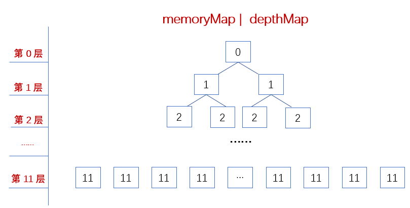

### PoolChunk
　　memoryMap 和 depthMap 存储的是层级关系，为 byte 对象的数组，在构造函数中对其 memoryMap 和 depthMap 初始化。<br />
  
- 假设 maxOrder 为 11，则会存储 4096 个 byte 对象，其值为 [0, 1, 1, 2, 2, 2, 2, 3, ..., 11]，按照二叉树排序，根节点为 0，第 1 层为 1，第二层为 2，以此类推到第 11 层为 11；
- 层级值越大，则其可用的内存越小；
    1. 层级值为 0，可用内存为一个 Chunk（默认 16M），有一个；
    2. 层级值为 1，可用内存为 8M，有两个；
    3. 层级值为 11，可用内存为 8K，有 2048 个。
 
 
 
 　　如上图，满二叉树适合用数组形式存储，即 [0, 1, 1, 2, 2, 2, 2, 3, ..., 11]。

```java
final class PoolChunk<T> implements PoolChunkMetric {

    private static final int INTEGER_SIZE_MINUS_ONE = Integer.SIZE - 1;

    final PoolArena<T> arena;
    // 内存空间
    final T memory;
    // 是否为非池化，即不从对象池中获取对象。当申请的内存大小为 Huge
    // 类型时，创建一整块 Chunk ，并且不拆分成若干 Page
    final boolean unpooled;
    // 偏移量
    final int offset;
    // 分配信息满二叉树
    private final byte[] memoryMap;
    // 高度信息满二叉树
    private final byte[] depthMap;
    // PoolSubpage 数组
    private final PoolSubpage<T>[] subpages;
    // 判断分配请求内存是否为 Tiny/Small，即分配 Subpage 内存块
    private final int subpageOverflowMask;
    // Page 大小，默认 8KB = 8192B
    private final int pageSize;
    // log2(8K) = 13
    // 从 1 开始左移到 {@link #pageSize} 的位数。默认 13 ，1 << 13 = 8192 。
    // * 具体用途，见 {@link #allocateRun(int)} 方法，计算指定容量所在满二叉树的层级。
    private final int pageShifts;
    // 满二叉树的高度，默认为 11
    private final int maxOrder;
    // 一个 Chunk 的大小，默认 16M
    private final int chunkSize;
    // 默认为 log2(16M) = 24
    private final int log2ChunkSize;
    // Subpage 数量，即二叉树最底层（深度 11）的数量，默认为 1 << 11 = 2048
    private final int maxSubpageAllocs;
    // 标记节点不可用，默认为 maxOrder + 1 = 12，因为节点信息为 [0-11]，值越大，
    // 表示可用内存值越大，0 为 16M，11 为 8K，12 则不可用
    private final byte unusable;

    private final Deque<ByteBuffer> cachedNioBuffers;
    // 剩余可用字节数
    private int freeBytes;
    // 所属 PoolChunkList 对象
    PoolChunkList<T> parent;
    // 前一个 Chunk 对象
    PoolChunk<T> prev;
    // 后一个 Chunk 对象
    PoolChunk<T> next;

    // TODO: Test if adding padding helps under contention
    //private long pad0, pad1, pad2, pad3, pad4, pad5, pad6, pad7;
```

### 构造函数（池化）
　　默认为池化，即可从对象池中获取和回收。

```java
    PoolChunk(PoolArena<T> arena, T memory, int pageSize, int maxOrder, int pageShifts, int chunkSize, int offset) {
        // 默认为池化
        unpooled = false;
        this.arena = arena;
        this.memory = memory;
        this.pageSize = pageSize;
        this.pageShifts = pageShifts;
        this.maxOrder = maxOrder;
        this.chunkSize = chunkSize;
        this.offset = offset;
        // maxOrder 默认为 11，unusable 为 12，标记节点不可用
        unusable = (byte) (maxOrder + 1);
        log2ChunkSize = log2(chunkSize);
        subpageOverflowMask = ~(pageSize - 1);
        freeBytes = chunkSize;

        // 二叉树高度要小于 30，因为 2^31 会溢出
        assert maxOrder < 30 : "maxOrder should be < 30, but is: " + maxOrder;
        // subpage 的数量，默认为 1 << 16 = 2048，即每个 subpage 为 8K
        maxSubpageAllocs = 1 << maxOrder;

        // Generate the memory map.
        // 生成满二叉树，为 Byte 数组（满二叉树适合用数组实现），其大小为 4096
        memoryMap = new byte[maxSubpageAllocs << 1];
        depthMap = new byte[memoryMap.length];
        // 二叉树节点编号从 1 开始，更容易计算父子节点关系，比如 4 的子节点为 4*2=8 和 4*（2+1）=9
        int memoryMapIndex = 1;
        // 遍历每层，从 0 到 11 层，填充 memoryMap 和 depthMap 的值，为 [0, 1, 1, 2, 2, 2, 2, 3, ..., 11]，
        // 最后一层有 2048 个 11
        for (int d = 0; d <= maxOrder; ++ d) {
            int depth = 1 << d;
            // 对每层的节点进行初始化，第 0 层有 1 << 0 = 1 个节点，第 1 层有 2 个节点，第 2 层有 4 个节点
            for (int p = 0; p < depth; ++ p) {
                // in each level traverse left to right and set value to the depth of subtree
                memoryMap[memoryMapIndex] = (byte) d;
                depthMap[memoryMapIndex] = (byte) d;
                // 节点数加一
                memoryMapIndex ++;
            }
        }

        // 初始化 subpages，生成 PoolSubpage 数组，其长度为 2048，即有 2048 个 PoolSubpage
        subpages = newSubpageArray(maxSubpageAllocs);
        // 初始化缓存 NioBuffer
        cachedNioBuffers = new ArrayDeque<ByteBuffer>(8);
    }
```

### 构造函数（非池化）
　　非池化，即不从对象池中获取对象。

```java
    PoolChunk(PoolArena<T> arena, T memory, int size, int offset) {
        unpooled = true;
        this.arena = arena;
        this.memory = memory;
        this.offset = offset;
        memoryMap = null;
        depthMap = null;
        subpages = null;
        subpageOverflowMask = 0;
        pageSize = 0;
        pageShifts = 0;
        maxOrder = 0;
        unusable = (byte) (maxOrder + 1);
        chunkSize = size;
        log2ChunkSize = log2(chunkSize);
        maxSubpageAllocs = 0;
        cachedNioBuffers = null;
    }
```
