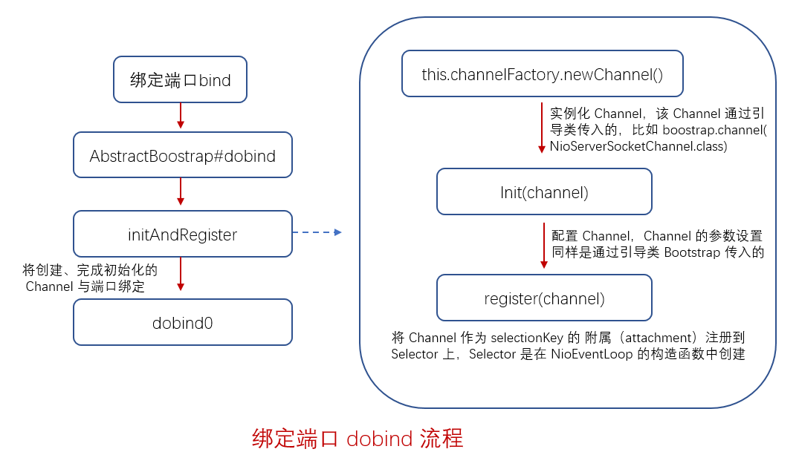

### Netty 服务端启动过程
　　这里使用一个简单例子来说明，在配置好 EventLoopGroup、Channel、ChannelHandler 等等，绑定端口最终会调用 dobind() 方法。

```java
public final class Server {
    
    public static void main(String[] args) throws Exception {
        // 主从 Reactor，bossGroup 为 mainReactor，workerGroup 为 subReactor
        EventLoopGroup bossGroup = new NioEventLoopGroup(1);
        EventLoopGroup workerGroup = new NioEventLoopGroup();

        try {
            // 设置引导类
            ServerBootstrap b = new ServerBootstrap();
            // 通过 group 将两大线程配置进来
            b.group(bossGroup, workerGroup)
                    // 设置服务端的 ServerSocketChannel
                    .channel(NioServerSocketChannel.class)
                    // 给后面指定的每个客户端的连接，设置 TCP 的基本属性
                    .childOption(ChannelOption.TCP_NODELAY, true)
                    // 每次创建客户端连接时，绑定一些基本的属性
                    .childAttr(AttributeKey.newInstance("childAttr"), "childAttrValue")
                    // 服务端启动过程中的处理逻辑
                    .handler(new ServerHandler())
                    .childHandler(new ChannelInitializer<SocketChannel>() {
                        @Override
                        public void initChannel(SocketChannel ch) {
                            ch.pipeline().addLast(new AuthHandler());
                            //..

                        }
                    });
            // 绑定端口，最终调用 dobind() 方法
            ChannelFuture f = b.bind(8888).sync();

            f.channel().closeFuture().sync();
        } finally {
            bossGroup.shutdownGracefully();
            workerGroup.shutdownGracefully();
        }
    }
}
```

- 在 mainReactor，即 bossGroup 的 NioEventLoopGroup 构造函数中，调用 openSelector 创建 Selector。一个线程，绑定一个 Selector，为客户端连接做准备；
- 创建服务端 Channel、初始化配置服务端 Channel；
- 将服务端 Channel 注册到 Selector 上。设置 ops 为 0，即对任何事件都不感兴趣；
- 绑定端口；
- 绑定成功后，会使用 pipeline，从 headContext 设置服务端 Channel 的 ops 为 OP_ACCEPT，完成服务端连接准备。之后客户端连接进来，会为其创建连接和读取数据。



### AbstractBootstrap#doBind
　　以服务端的 NioEventLoopGroup 为例，在[构造函数中](https://github.com/martin-1992/Netty-Notes/blob/932d84af92758d157f544186146f943a6c2a5778/NioEventLoop/NioEventLoop%20%E7%9A%84%E5%88%9B%E5%BB%BA/NioEventLoop%20%E7%9A%84%E6%9E%84%E9%80%A0%E5%87%BD%E6%95%B0.md)，它会创建一个服务端的 Selecotr。然后在调用绑定端口时，会创建 ServerSocketChannel，然后初始化 ServerSocketChannel，最后将 ServerSocketChannel 注册到之前 NioEventLoopGroup 创建的 Selector 上。
- [initAndRegister](https://github.com/martin-1992/Netty-Notes/blob/master/Netty%20%E6%9C%8D%E5%8A%A1%E7%AB%AF%E5%90%AF%E5%8A%A8%E8%BF%87%E7%A8%8B/initAndRegister.md)，创建 Channel、初始化配置 Channel、将 Channel 注册到 EventLoop（事件轮询器 Selector）；
- [doBind0](https://github.com/martin-1992/Netty-Notes/blob/master/Netty%20%E6%9C%8D%E5%8A%A1%E7%AB%AF%E5%90%AF%E5%8A%A8%E8%BF%87%E7%A8%8B/doBind0.md)，调用 JDK 底层 API 将端口与 [initAndRegister](https://github.com/martin-1992/Netty-Notes/blob/master/Netty%20%E6%9C%8D%E5%8A%A1%E7%AB%AF%E5%90%AF%E5%8A%A8%E8%BF%87%E7%A8%8B/initAndRegister.md) 创建好的 Channel 进行绑定，并添加监听器。

```java
    private ChannelFuture doBind(final SocketAddress localAddress) {
        // 创建、初始化、注册 Channel
        final ChannelFuture regFuture = initAndRegister();
        final Channel channel = regFuture.channel();
        if (regFuture.cause() != null) {
            return regFuture;
        }

        if (regFuture.isDone()) {
            // At this point we know that the registration was complete and successful.
            ChannelPromise promise = channel.newPromise();
            // 绑定端口
            doBind0(regFuture, channel, localAddress, promise);
            return promise;
        } else {
            // ...
                }
            });
            return promise;
        }
    }
```
