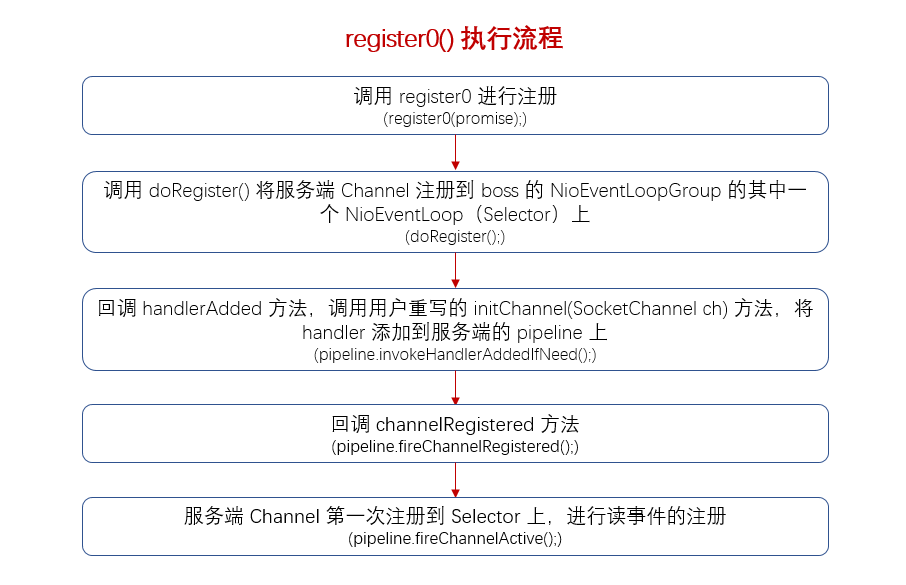

### config().group().register(channel)
　　调用 JDK 底层来注册，将 Channel 注册到 EventLoop（事件轮询器 Selector） 上。<br />
　　调用顺序为：AbstractBootstrap#register -> MultithreadEventLoopGroup#register -> SingleThreadEventLoop#register -> AbstractChannel#register -> AbstractChannel#register0 -> AbstractNioChannel#doRegister（子类实现的 doRegister 方法）。<br />
　　在 MultithreadEventLoopGroup#register 方法中，其实现为 next().register(channel); 这里的 next() 是从 EventLoopGroup 中选择其中一个 EventLoop 进行绑定，选择方法有两种，分别为 [PowerOfTwoEventExecutorChooser#next() 和 GenericEventExecutorChooser#next()](https://github.com/martin-1992/Netty-Notes/blob/932d84af92758d157f544186146f943a6c2a5778/NioEventLoop/NioEventLoop%20%E7%9A%84%E5%88%9B%E5%BB%BA/newChooser.md)，这里是 Netty 高性能的体现。当 EventLoopGroup 的大小为 2 的幂时，则会使用位运算获取，提高性能。而 Netty 的 EventLoopGroup，比如 NioEventLoopGroup 的参数默认是一个核心 2 个线程的。

### SingleThreadEventLoop#register
　　this 为该类 SingleThreadEventLoop 的实例，而该类继承了 SingleThreadEventExecutor，为线程。将 Channel 和执行器 EventExecutor 包装成 DefaultChannelPromise。

```java
public abstract class SingleThreadEventLoop extends SingleThreadEventExecutor implements EventLoop {
    
    @Override
    public ChannelFuture register(Channel channel) {
        return register(new DefaultChannelPromise(channel, this));
    }
```

### SingleThreadEventLoop#register
　　将 DefaultChannelPromise 注册到 Selector，它是一个线程 EventLoop，this 为 SingleThreadEventLoop 类的实例。

```java
    @Override
    public ChannelFuture register(final ChannelPromise promise) {
        ObjectUtil.checkNotNull(promise, "promise");
        promise.channel().unsafe().register(this, promise);
        return promise;
    }
```

### AbstractChannel#register

- 通过检查 Channel 的属性 registered 来判断是否已经注册到线程 EventLoop（Selector），是则抛出异常；
- 检查 EventLoop 的类型。类型不对，抛出异常。比如 Nio 的，则 eventLoop 类型需为 NioEventLoop；
- 注册 EventLoop，后续 Channel 的操作，都是由 EventLoop 来处理；
- 判断当前线程是否为 EventLoop，只有在 EventLoop 线程才可进行操作；
- register0，注册的核心逻辑；
- 注意，主线程启动时，是不在 EventLoop 线程的，所以会创建一个线程执行注册逻辑。

```java
    private volatile EventLoop eventLoop;

    @Override
    public final void register(EventLoop eventLoop, final ChannelPromise promise) {
        // 没有可注册的 EventLoop，抛出异常
        if (eventLoop == null) {
            throw new NullPointerException("eventLoop");
        }
        // 检查该 Channel 的属性（volatile registered），为 true 即已经注册过，抛出异常
        if (isRegistered()) {
            promise.setFailure(new IllegalStateException("registered to an event loop already"));
            return;
        }
        // 类型不对，比如 Nio 的，则 eventLoop 类型需为 NioEventLoop
        if (!isCompatible(eventLoop)) {
            promise.setFailure(
                    new IllegalStateException("incompatible event loop type: " + eventLoop.getClass().getName()));
            return;
        }
        // 将该 EventLoop（Selector）绑定到该 Channel 实例上，后续 IO 操作都由 eventLoop 来处理
        AbstractChannel.this.eventLoop = eventLoop;
        
        // 判断当前线程是否为 EventLoop，只有在 EventLoop 线程才可进行操作
        if (eventLoop.inEventLoop()) {
            register0(promise);
        } else {
            try {
                // 注意，主线程启动时，是不在 EventLoop 线程的，所以会跳过，执行下面部分，
                // 创建一个线程执行注册逻辑
                eventLoop.execute(new Runnable() {
                    @Override
                    public void run() {
                        register0(promise);
                    }
                });
            } catch (Throwable t) {
                logger.warn(
                        "Force-closing a channel whose registration task was not accepted by an event loop: {}",
                        AbstractChannel.this, t);
                closeForcibly();
                closeFuture.setClosed();
                safeSetFailure(promise, t);
            }
        }
    }
```

### AbstractChannel#register0



- 调用 doRegister() 方法，将服务端 Channel 注册到 bossGroup 的 NioEventLoopGroup 的其中一个 NioEventLoop（Selector） 上。doRegister() 方法在 AbstractChannel#doRegister 实现为空，交由子类来实现，这里以 AbstractNioChannel#doRegister 为例。通过自旋，**调用 JDK 底层来注册，保证 Channel 注册到 EventLoop（Selector） 上，** 获取 selectionKey，设置 ops 为 0，表示对任何事物不感兴趣；
- 调用 pipeline.invokeHandlerAddedIfNeeded()，回调 handlerAdded 方法，最终会调用 initChannel(Channel) 方法，该方法是用户重写的。添加用户自定义的 ChannelHandler 到 pipeline 中；
- 当新连接注册到 EventLoop（Selector） 上，第一次注册时会调用 [pipeline.fireChannelActive]()，从 HeadContext 开始，为服务端的 Channel 配置。在 doBeginRead() 中会设置该 Selector 的 selectionKey，之前注册时 ops 为 0，这里设置 ops 为 readInterestOp，可为客户端连接创建连接和读取数据。

```java
        private void register0(ChannelPromise promise) {
            try {
                if (!promise.setUncancellable() || !ensureOpen(promise)) {
                    return;
                }
                boolean firstRegistration = neverRegistered;
                //  将 Channel 注册到 EventLoop（Selector） 上，这里的 ops 为 0，表示对任何事件都不感兴趣
                doRegister();
                // 从 true 变为 false，表示已经注册过了
                neverRegistered = false;
                registered = true;

                // 回调 handlerAdded 方法，最终会调用 initChannel(Channel) 方法，该方法
                // 是用户重写的，添加用户自定义的 ChannelHandler 到 pipeline 中
                pipeline.invokeHandlerAddedIfNeeded();

                safeSetSuccess(promise);
                // 回调 channelRegistered 方法
                pipeline.fireChannelRegistered();
                // 前面提到在 doRegister 中，ops 是为 0，这里判定为第一次注册，所以会使用 pipeline，调用 HeadContext
                // 注册一个读事件
                if (isActive()) {
                    if (firstRegistration) {
                        // 第一次注册，读事件绑定
                        pipeline.fireChannelActive();
                    } else if (config().isAutoRead()) {
                        // 设置 ops 为 readInterestOp，从而可接收客户端的连接和读事件
                        beginRead();
                    }
                }
            } catch (Throwable t) {
                // Close the channel directly to avoid FD leak.
                closeForcibly();
                closeFuture.setClosed();
                safeSetFailure(promise, t);
            }
        }
```

#### DefaultChannelPipeline#HeadContext
　　调用 pipeline 的 handler，从 HeadContext 开始，为服务端的 Channel 配置。

```java
    @Override
    public void channelActive(ChannelHandlerContext ctx) {
        // 端口绑定后，才触发的
        ctx.fireChannelActive();
        // 自动注册读事件，连接底层对应的 NioEventLoop 对应的 Selector，它可以轮询到一个读事件，
        // 读事件包括创建连接和读取数据
        readIfIsAutoRead();
    }
    
    private void readIfIsAutoRead() {
        // 客户端 Channel 和 服务端 Channel 都会调用该函数，默认是自动读的
        // 即默认情况下，绑定端口则接受连接，当前连接绑定到 selector 上，则
        // 会自动读，即向 selector 注册一个读事件
        if (channel.config().isAutoRead()) {
            channel.read();
        }
    }
```

#### AbstractChannel#beginRead
　　调用 doBeginRead。

```java
    @Override
    public final void beginRead() {
        // 判断当前线程必须在 EventLoop
        assertEventLoop();
        if (!isActive()) {
            return;
        }

        try {
            // 核心逻辑
            doBeginRead();
        } catch (final Exception e) {
            invokeLater(new Runnable() {
                @Override
                public void run() {
                    pipeline.fireExceptionCaught(e);
                }
            });
            close(voidPromise());
        }
    }
```

#### AbstractNioChannel#doBeginRead
　　前面提到在 doRegister 中，selectionKey 的 ops 是为 0。当 Channel 注册到 Selector 后，会调用该方法，重新设置 selectionKey 中的 ops 为 readInterestOp，表示对读事件感兴趣，**这样服务端就可以接收客户端的连接和读事件。**

```java
    @Override
    protected void doBeginRead() throws Exception {
        // Channel.read() or ChannelHandlerContext.read() was called
        final SelectionKey selectionKey = this.selectionKey;
        if (!selectionKey.isValid()) {
            return;
        }

        readPending = true;

        final int interestOps = selectionKey.interestOps();
        // 检测到 interestOps 为  0，之前没有监听 readInterestOp，这里进行监听
        if ((interestOps & readInterestOp) == 0) {
            selectionKey.interestOps(interestOps | readInterestOp);
        }
    }
```

### AbstractNioChannel#doRegister
　　通过自旋，调用 JDK 底层来注册，保证 Channel 注册到 EventLoop（Selector） 上，这里注册的 this 指的是 AbstractNioChannel，将其作为 SelectableChannel 类的附属 attachment，注册到 Selector 上。在 [processSelectedKeys](https://github.com/martin-1992/Netty-Notes/blob/master/NioEventLoop/NioEventLoop%20%E7%9A%84%E5%90%AF%E5%8A%A8/processSelectedKeys.md) 方法中，Selector 轮询 SelectionKey 时，会取出该 key 的 attachment，即 AbstractNioChannel，检查该 AbstractNioChannel 是否有 IO 事件要处理。<br />
　　当服务端的连接 ServerSocketChannel 注册到 Selector 时，**这里的 ops 为 0，即对任何事件都不感兴趣。当绑定端口成功后，才会设置 ops 为 OP_ACCEPT，表示服务端连接已经绑定好端口，可以为客户端的连接创建连接 SocketChannel，以及读取数据。**

```java
    @Override
    protected void doRegister() throws Exception {
        boolean selected = false;
        // 自旋过程，保证注册成功，失败则抛出异常
        for (;;) {
            try {
                // 调用 JDK 底层来注册，channel 是通过 AbstractBootstrap#this.channelFactory.newChannel() 
                // 进行创建的，将 Channel 注册到 Selector 上，这里注册为 0，表示对任何事件都不感兴趣，接下来在
                // 绑定端口时，会调用 pipeline.fireChannelActive() 进行读事件注册，即可为客户端连接创建连接和
                // 读取数据
                selectionKey = javaChannel().register(eventLoop().unwrappedSelector(), 0, this);
                return;
            } catch (CancelledKeyException e) {
                if (!selected) {
                    eventLoop().selectNow();
                    selected = true;
                } else {
                    throw e;
                }
            }
        }
    }
```
