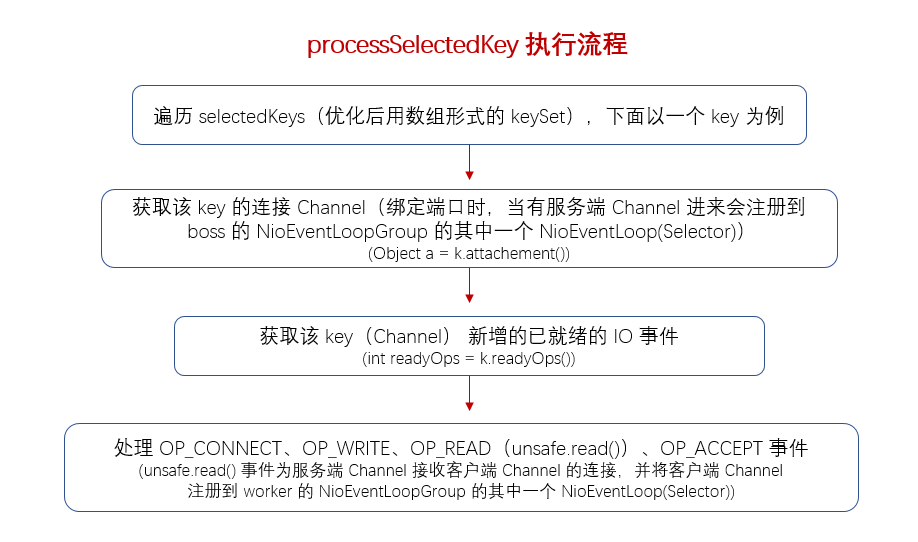

### NioEventLoop#processSelectedKey() 执行逻辑

- selectedKeys 为优化后的 keySet，在NioEventLoop 的构造函数中会调用 openSelector 方法，创建一个优化的 Selector，该 Selector 的 selectedKeys 为数组形式的 keySet，替换掉原先 hashset 形式的 keySet，遍历 keySet 效率更高；
- selectedKeys 中每个 key 是在 [Netty 服务端启动过程#AbstractNioChannel#register](https://github.com/martin-1992/Netty-Notes/blob/master/Netty%20%E6%9C%8D%E5%8A%A1%E7%AB%AF%E5%90%AF%E5%8A%A8%E8%BF%87%E7%A8%8B/register.md) 进行注册的，每个 key 的 attachment 对应一个 AbstractNioChannel，调用 processSelectedKey 进行处理该 Channel 已就绪的 IO 事件；
- processSelectedKeysOptimized()，使用优化后的 keySet 来处理每个 key 的附属 attachment（包含 Channel），获取该 Channel 新增的已就绪的感兴趣的 IO 事件，包含OP_CONNECT 连接，OP_WRITE 写， OP_READ 读，OP_ACCEPT 新连接事件，针对不同的 IO 事件进行处理。

### NioEventLoop#processSelectedKeys
　　selectedKeys 为优化后的 keySet，在 [NioEventLoop 的构造函数](https://github.com/martin-1992/Netty-Notes/tree/master/NioEventLoop/NioEventLoop%20%E7%9A%84%E5%88%9B%E5%BB%BA) 中会调用 openSelector 方法，创建一个优化的 Selector，该 Selector 的 selectedKeys 为数组形式的 keySet，替换掉原先 hashset 形式的 keySet。keySet 用于存放注册到该 Selector 的 Channel，通过轮询方式对该 Channel 已就绪的事件进行相应处理，轮询即数组遍历，效率更高。

```java
    private void processSelectedKeys() {
        // NioEventLoop 的构造函数中会调用 openSelector 方法，创建一个优化的 Selector，该 Selector 的
        // selectedKeys 为数组形式的 keySet，替换掉原先 hashset 形式的 keySet
        if (selectedKeys != null) {
            processSelectedKeysOptimized();
        } else {
            // 为空，表示没有使用优化后的 keySet
            processSelectedKeysPlain(selector.selectedKeys());
        }
    }
```

### NioEventLoop#processSelectedKeysOptimized
　　遍历 keySet，keySet 中的每个 key 是在 [Netty 服务端启动过程#AbstractNioChannel#register](https://github.com/martin-1992/Netty-Notes/blob/master/Netty%20%E6%9C%8D%E5%8A%A1%E7%AB%AF%E5%90%AF%E5%8A%A8%E8%BF%87%E7%A8%8B/register.md) 进行注册的，每个 key 的 attachment 对应一个 AbstractNioChannel，调用 processSelectedKey 进行处理该 Channel 已就绪的 IO 事件。

```java
    private void processSelectedKeysOptimized() {
        // 遍历 keySet，获取每个 key 对应的 Channel，Netty 使用数组形式的 keySet，遍历更高效
        for (int i = 0; i < selectedKeys.size; ++i) {
            // 这里 key 是在 [Netty 服务端启动过程#AbstractNioChannel#register] 进行注册的，
            // 每个 key 的 attachment 对应一个 AbstractNioChannel
            final SelectionKey k = selectedKeys.keys[i];
            // null out entry in the array to allow to have it GC'ed once the Channel close
            // See https://github.com/netty/netty/issues/2363
            // 用于 GC 回收
            selectedKeys.keys[i] = null;
            // attachment 为 Channel，在 Netty 服务端的启动过程中，是将 Channel 作为 key 的 附属 attachment
            // 注册到 Selector 中，然后这里获取的 attachment 即为 Channel
            final Object a = k.attachment();
           
            if (a instanceof AbstractNioChannel) {
                // 处理该 Channel 感兴趣的事件
                processSelectedKey(k, (AbstractNioChannel) a);
            } else {
                // 不为 AbstractNioChannel，则转为 NioTask 进行处理
                @SuppressWarnings("unchecked")
                NioTask<SelectableChannel> task = (NioTask<SelectableChannel>) a;
                processSelectedKey(k, task);
            }
            // 需要重新进行一次无阻塞的 select 方法，获取增加的已就绪的感兴趣的 IO 事件
            if (needsToSelectAgain) {
                // null out entries in the array to allow to have it GC'ed once the Channel close
                // See https://github.com/netty/netty/issues/2363
                selectedKeys.reset(i + 1);

                selectAgain();
                i = -1;
            }
        }
    }
```

### NioEventLoop#processSelectedKey
　　处理该 Channel 已就绪的 IO 事件。



- key 不合法，关闭该 Channel；
- key 合法，获取这个 key 已就绪的 IO 事件，有 OP_CONNECT 连接，OP_WRITE 写，OP_READ 读，OP_ACCEPT 新连接事件等；
- 当 OP_CONNECT 事件已就绪；
    1. 获取该 key（Channel）感兴趣的事件；
    2. 移除掉对 OP_CONNECT 感兴趣，因为只需获取一次 OP_CONNECT 事件，建立连接即可；
    3. 设置该 Channel 感兴趣的事件，已移除掉 OP_CONNECT；
    4. 完成连接。
- OP_WRITE 写事件就绪；
- 检测到 read 操作或 accept 操作，则调用 NioMessageUnsafe.read 方法。

```java
    private void processSelectedKey(SelectionKey k, AbstractNioChannel ch) {
        // AbstractNioMessageChannel$NioMessageUnsafe
        final AbstractNioChannel.NioUnsafe unsafe = ch.unsafe();
        // key 不合法，关闭该 Channel
        if (!k.isValid()) {
            final EventLoop eventLoop;
            try {
                // 可能是不在 EventLoop 线程，获取 EventLoop 线程
                eventLoop = ch.eventLoop();
            } catch (Throwable ignored) {
                return;
            }
            // eventLoop 线程不为 NioEventLoop，返回
            if (eventLoop != this || eventLoop == null) {
                return;
            }
            // close the channel if the key is not valid anymore
            unsafe.close(unsafe.voidPromise());
            return;
        }

        try {
            // key 合法，获取这个 key 已就绪的 IO 事件，有 OP_CONNECT 连接，OP_WRITE 写，
            // OP_READ 读，OP_ACCEPT 新连接事件等
            int readyOps = k.readyOps();
            // OP_CONNECT 事件已就绪
            if ((readyOps & SelectionKey.OP_CONNECT) != 0) {
                // 获取该 key（Channel）感兴趣的事件
                int ops = k.interestOps();
                // 移除掉对 OP_CONNECT 感兴趣，因为只需获取一次 OP_CONNECT 事件，建立连接即可
                ops &= ~SelectionKey.OP_CONNECT;
                // 设置该 Channel 感兴趣的事件，已移除掉 OP_CONNECT
                k.interestOps(ops);
                // 完成连接
                unsafe.finishConnect();
            }

            // OP_WRITE 写事件就绪
            if ((readyOps & SelectionKey.OP_WRITE) != 0) {
                ch.unsafe().forceFlush();
            }

            // 检测到 read 操作或 accept 操作，则调用 NioMessageUnsafe.read 方法
            if ((readyOps & (SelectionKey.OP_READ | SelectionKey.OP_ACCEPT)) != 0 || readyOps == 0) {
                // AbstractNioMessageChannel 的 read 方法
                unsafe.read();
            }
        } catch (CancelledKeyException ignored) {
            unsafe.close(unsafe.voidPromise());
        }
    }
```
